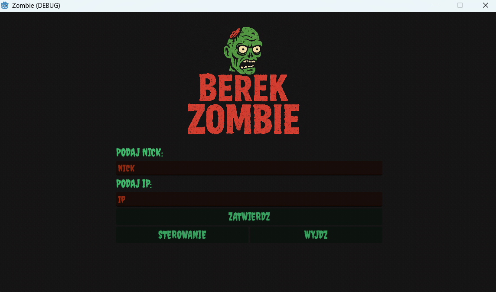
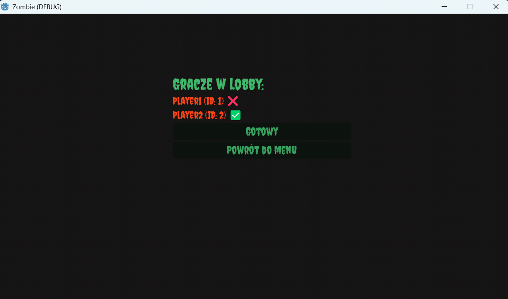
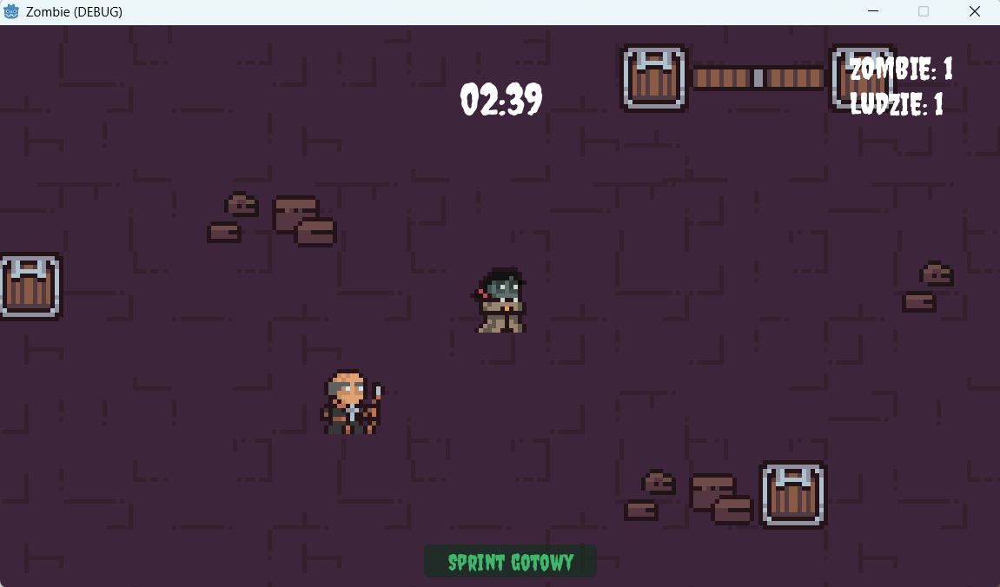
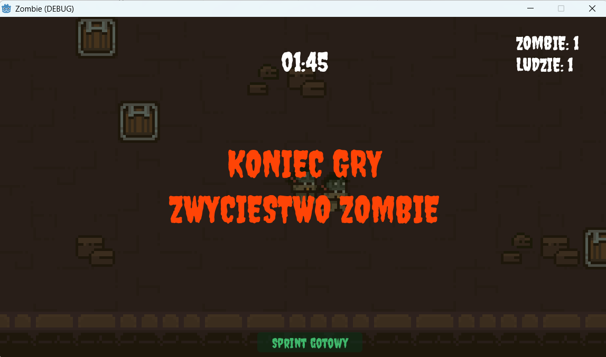

# Zombie Tag (Berek Zombie)

**Team:**  
- https://github.com/pomiano
- https://github.com/mateushhh
- https://github.com/maciejblawat

---

## Overview

**Zombie Tag** is a real-time multiplayer game where players are humans or zombies.  
- Humans must avoid being infected for a set time.  
- Zombies aim to infect all humans.  
- Round ends when either all humans are infected or time runs out.  

Built with **Godot** (GDScript) for the client and **Python** for the server. Uses **UDP** for fast multiplayer synchronization.

---

## Gameplay

- Up to 8 players per game  
- Round duration: 180 seconds  
- One player starts as zombie, the rest are humans  
- Humans can move freely, avoid zombies, and use a short sprint  
- Zombies infect humans on contact  
- Obstacles on the map block movement  

---

## Features

- Real-time multiplayer gameplay  
- Smooth synchronization via UDP  
- Dynamic player roles (humans ↔ zombies)  
- Interactive GUI: player counts, timers, sprint bar  
- Cross-platform: tested on MacOS & Windows  

---

## Tech Stack

- **Client:** Godot Engine, GDScript  
- **Server:** Python (UDP)  
- **Networking:** Real-time tick updates using UDP  
- **Architecture:** Client-server model  

---

## How to Play

1. Start the Python server.  
2. Launch the Godot client and connect to the server.  
3. Join a lobby (max 8 players).  
4. Survive as a human or infect others as a zombie.  

---

##  Screenshots

  
  
  
  

---

